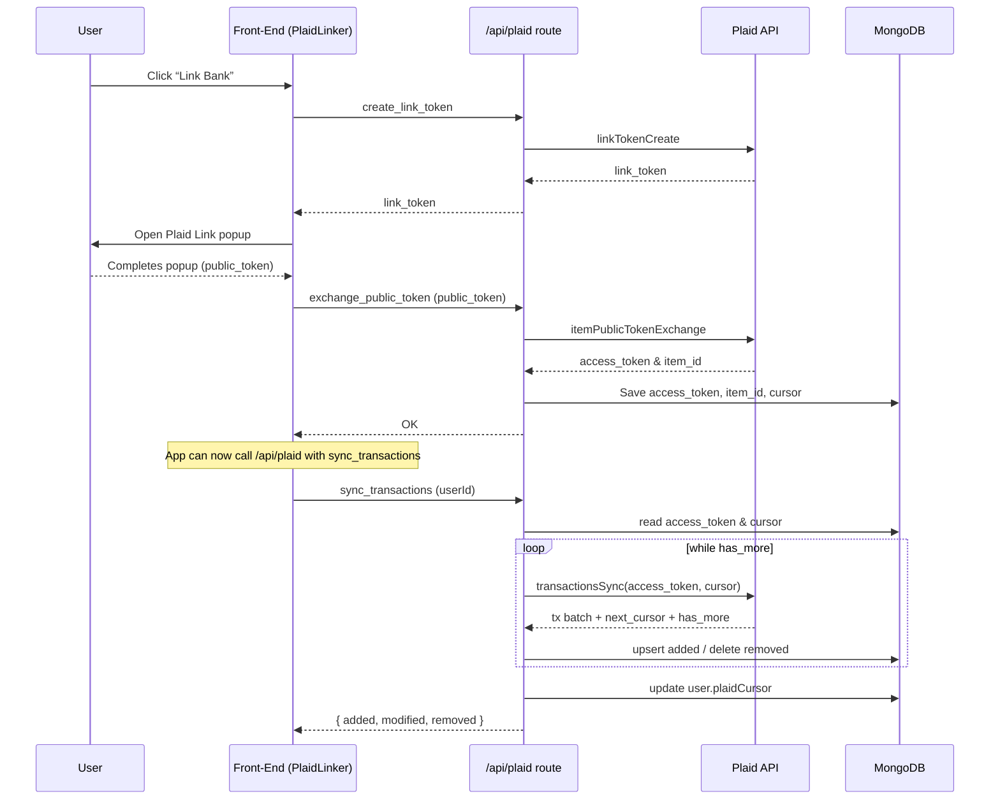

# Plaid Integration – Current Architecture

> Last updated: 2025-10-17

This document explains **how Plaid is wired into _My Budget Tracker_ today**, covering every step from a user clicking “Link Bank” to ongoing transaction syncs.

---

## 1. Front-End Entry Point – `PlaidLinker.jsx`

| Phase | What Happens |
|-------|--------------|
| **Mount** | `PlaidLinker` calls `/api/user/bank-status` → sets `bankLinked` so the UI knows whether to show **Link Bank** or **Bank linked**. |
| **User clicks “Link Bank”** | 1. `createLinkToken()` ➜ `POST /api/plaid` `{ action: "create_link_token", userId }`  <br>2. Route requests `linkTokenCreate()` from Plaid and returns **link_token**. <br>3. The token is passed to the Plaid Link widget (`usePlaidLink`). |
| **Link flow success** | Widget supplies a **public_token** → `PlaidLinker` immediately sends `POST /api/plaid` `{ action: "exchange_public_token", public_token, userId }`. |

---

## 2. `/api/plaid` Route (multi-action)

Filename: `src/app/api/plaid/route.js`

| Action | Logic |
|--------|-------|
| `create_link_token` | Calls `plaid.linkTokenCreate()` and returns link token JSON. |
| `exchange_public_token` | Calls `plaid.itemPublicTokenExchange()` → receives **access_token** & **item_id**. <br> Performs an initial transaction sync. <br>Saves to `User` document: <br>`plaidAccessToken`, `plaidItemId`, `plaidCursor`, `bankLinked = true`. |
| `sync_transactions` | Performs an incremental transaction sync using the stored cursor. Updates `added`, `modified`, and `removed` transactions in the `PlaidTransaction` collection. |

---

## 3. Plaid Client Helper – `lib/plaidClient.js`

```js
import { Configuration, PlaidApi, PlaidEnvironments } from 'plaid';

export default function getPlaidClient() { /* singleton */ }
```

*  Wraps Plaid SDK init in a singleton so each serverless cold-start creates the client just once.
*  Reads credentials & environment from **env vars** (below).

---

## 4. Incremental Transaction Sync – `/api/plaid` (`sync_transactions` action)

Endpoint: `POST /api/plaid` `{ action: "sync_transactions", userId }`

1. Verify user & retrieve `plaidAccessToken` and last `plaidCursor`.
2. Loop `transactionsSync()` while `has_more === true`.
3. **Added** transactions → upsert into `PlaidTransaction` collection.
4. **Modified** transactions → update in collection.
5. **Removed** transactions → delete from collection.
6. Update user’s `plaidCursor` so the next sync only pulls deltas.
7. Return `{ added, modified, removed }` for UI/logging.

Typical trigger mechanisms: cron job, webhook, or manual button.

---

## 5. Data Models Touched

* **User** (`models/User.js`)
  * `plaidAccessToken`
  * `plaidItemId`
  * `plaidCursor`
  * `bankLinked`

* **PlaidTransaction** (`models/PlaidTransaction.js`)
  * Stores raw Plaid transactions.

---

## 6. Required Environment Variables

| Variable | Example | Notes |
|----------|---------|-------|
| `PLAID_CLIENT_ID` | `plaid-client-id` | From Plaid dashboard |
| `PLAID_SECRET` | `super-secret` | From Plaid dashboard |
| `PLAID_ENV` | `sandbox` \| `development` \| `production` | Determines Plaid base URL |
| `PLAID_PRODUCTS` | `transactions` | Comma-separated list |
| `PLAID_COUNTRY_CODES` | `US` | e.g. `US,CA` |

---

## 7. End-to-End Sequence Diagram



---

## 8. Performance Notes

* **Link flow** is entirely client-side (Plaid Link widget runs in browser).  
* **Data fetching** uses serverless **Route Handlers** – suitable for Next.js App Router.
* `transactionsSync()` is incremental and efficient once the initial cursor is stored.

---

## 9. Future Improvements

* Use Plaid **webhooks** to trigger the sync automatically on new transactions.
* Add retries / exponential back-off around Plaid calls.
* Encrypt `plaidAccessToken` at rest.

---

_This documentation will be kept up-to-date as the integration evolves._