# Current Transactions Flow (July 2025)

This document describes **how transactions are ingested, stored, and kept up-to-date** in the My Budget Tracker app after the recent refactor that removed `PendingTransaction` and introduced `PlaidTransaction`.

---

## 1. High-level Overview

1. User links their bank via **Plaid Link** (`PlaidLinker` component).
2. The `Plaid` API route exchanges the `public_token` for an `access_token` and stores it on the `User` document.
3. Still in the same flow, the front-end calls `action: "get_transactions"` which triggers the initial **full sync**:
   * The server calls `transactionsSync` with `cursor: null`.
   * Every transaction returned by Plaid is **upserted** into the `PlaidTransaction` collection.
   * The `next_cursor` is saved on the `User` document for future incremental syncs.
4. Any time afterwards the user can press **“Sync”** in `PlaidLinker`. That button again sends `action: "get_transactions"` to `/api/plaid`, which:
   * Looks up the stored `access_token` (if not supplied).
   * Requests `transactionsSync` with `cursor: null` (for now this still performs a full sync).
   * Upserts the returned transactions into `PlaidTransaction`.

> **Note**: At the moment there is **no categorisation / pending queue**; we are simply taking Plaid’s raw feed and persisting it for future work.

---

## 2. Database Collections

| Collection           | Purpose                                                     |
|----------------------|-------------------------------------------------------------|
| `User`               | Stores Plaid `access_token`, `item_id`, latest `plaidCursor`|
| `PlaidTransaction`   | One document per Plaid `transaction_id`, keyed by user      |

`PlaidTransaction` schema (simplified):
```js
{
  userId: ObjectId,          // owner
  transactionId: String,     // Plaid ID – unique index
  amount: Number,
  date: Date,
  description: String,
  category: String,          // primary.detailed or first category
  raw: Mixed                 // full Plaid tx JSON for flexibility
}
```

---

## 3. Detailed Sequence Diagram

```mermaid
sequenceDiagram
    participant FE as Front-End (PlaidLinker)
    participant API as /api/plaid
    participant Plaid as Plaid API
    participant DB as MongoDB

    %% Initial sync (access_token already stored on User)
    FE->>API: POST get_transactions (userId)
    API->>DB: lookup User & access_token 🔑
    API->>Plaid: transactionsSync(cursor=null)
    Plaid-->>API: [{tx1, tx2, …}, next_cursor]
    API->>DB: bulk upsert → PlaidTransaction
    API->>DB: update User.plaidCursor = next_cursor
    API-->>FE: { imported: N }

    %% Manual sync later
    FE->>API: POST get_transactions (userId)
    API->>DB: lookup access_token & cursor
    API->>Plaid: transactionsSync(cursor=null)
    Plaid-->>API: [{tx…}, next_cursor]
    API->>DB: upsert into PlaidTransaction
    API->>DB: update cursor
    API-->>FE: { imported: M }
```



---

## 4. Future Work

* Switch `transactionsSync` calls to **incremental** mode by supplying the user’s saved cursor.
* Re-introduce a categorisation pipeline (possibly re-using the old `PendingTransaction` UI) that reads from `PlaidTransaction`.
* Build querying endpoints & UI to display the synced transactions.

---

_Last updated: 19 Jul 2025_
